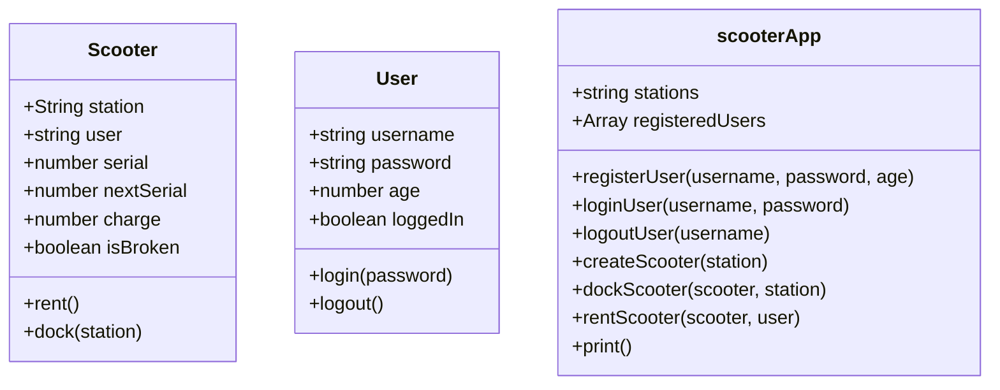

```mermaid
classDiagram
    class Scooter
    Scooter : +String station
    Scooter : +string user
    Scooter : +number serial
    Scooter : +number nextSerial
    Scooter : +number charge
    Scooter : +boolean isBroken

    Scooter : +rent()
    Scooter : +dock(station)

    class User
    User : +string username
    User : +string password
    User : +number age
    User : +boolean loggedIn

    User : +login(password)
    User : +logout()

    class scooterApp
    scooterApp : +string stations
    scooterApp : +Array registeredUsers
    
    scooterApp : +registerUser(username, password, age)
    scooterApp : +loginUser(username, password)
    scooterApp : +logoutUser(username)
    scooterApp : +createScooter(station)
    scooterApp : +dockScooter(scooter, station)
    scooterApp : +rentScooter(scooter, user)
    scooterApp : +print()

    
    

```